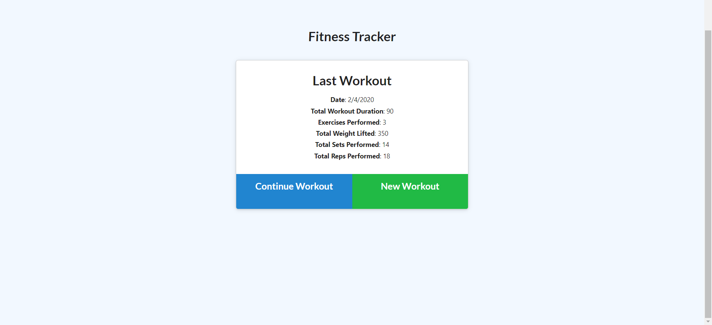
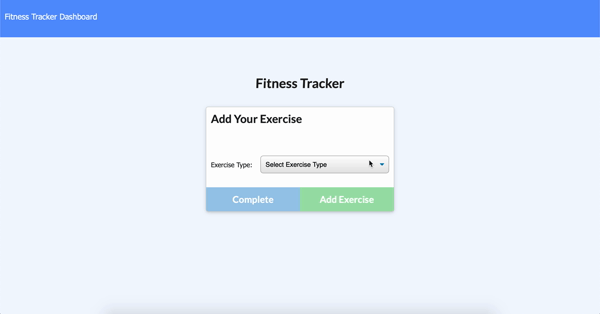
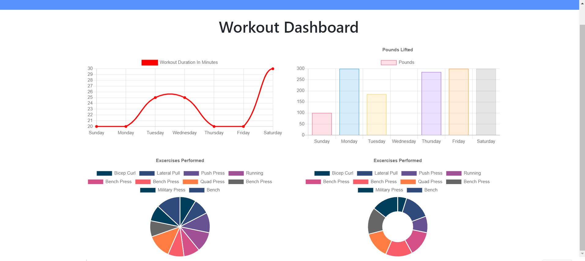

# Fitness Tracker

Track your workouts for the week

## Getting Started

1. Clone repository. 
2. Check in routes/api-routes and comment in block of code if you want the database to be prepopulated with dummy values
3. npm install
4. node server.js

Running seeders/seed.js is optional to have a prepopulated database.

## Site Pictures

1. Homepage displaying last workout

2. Creating Workouts

3. Last Week's Summary

## Built With

* [HTML]
* [CSS]
* [Bootstrap]
* [Javascript]
* [Node.js]
* [Express]
* [MongoDB]

## Deployed Link

* [See Live Site]()

## Author

 * **Wayil Mustafa** 

## Links

- [Link to site repository](https://github.com/waymg/fitnesstracker)
- [Link to Github](https://www.github.com/waymg)
- [Link to LinkedIn](https://www.linkedin.com/in/wayil-mustafa-a78313199/)
